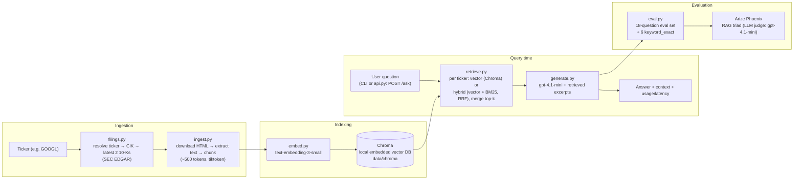

# Filings RAG Assistant

[](https://github.com/galaxyzhangdev/filings-rag-assistant/actions/workflows/ci.yml)

A retrieval-augmented generation (RAG) question-answering system over SEC
10-K filings, built as a personal portfolio project to demonstrate RAG
pipeline design and evaluation practice. Not a work project — no employer
data, no confidential information.

Ask questions like *"Which company had higher revenue, Alphabet or
Micron?"* and get an answer grounded in the actual filing text, with the
retrieved excerpts and cost/latency tracked.

## Architecture



Ingestion is generic (any ticker resolvable on SEC EDGAR); the hand-written
eval set and all reported metrics below are scoped to two companies,
**Alphabet (GOOGL)** and **Micron (MU)**, each with its latest 2 years of
10-K filings (782 chunks total: 394 GOOGL + 388 MU).

## Key design decisions

### Hybrid retrieval (BM25 + vector, RRF)

Pure vector search can miss exact figures and rare terms (e.g. "CMBU",
"1ß", a specific dollar amount) that don't paraphrase well semantically.
`retrieve(question, method="hybrid")` adds a keyword path next to the
default `method="vector"`:

- **BM25** (`rank_bm25.BM25Okapi`), one index per ticker, built lazily in
  memory from the chunks already stored in Chroma. Tokenizer: lowercase +
  `re.findall(r"\w+")`, so numbers and terms like "HBM" stay searchable.
- **Per ticker**: top 20 from vector search + top 20 from BM25, fused with
  **Reciprocal Rank Fusion** (`score = Σ 1/(60 + rank)`), keep `top_k`.
  RRF uses only ranks, so the two very different score scales (cosine vs.
  BM25) never need normalizing. Retrieval stays per ticker (see the
  cross-company bug below).
- Same return shape as vector; `score` is the RRF score (~0.016–0.033),
  used only for ordering. Default stays `"vector"`.

**Results** — vector and hybrid scored in the same run (same judge, same
day), 18 original questions:

| Metric | Vector | Hybrid |
|---|---|---|
| Context relevance | 0.83 | 0.78 |
| Groundedness | 0.94 | 0.94 |
| Answer relevance | 1.00 | 1.00 |
| Total tokens | 97,014 | 97,070 |

Historical reference (earlier run, vector): 0.83 / 1.00 / 1.00. The vector
answers in both runs are the *same cached answers*, so its groundedness
moving 1.00 → 0.94 is purely LLM-judge noise. The 0.05 context-relevance
gap is one question (the "current stock price" should-abstain question,
where irrelevant context is the expected outcome anyway) and within judge
noise. **On the original 18 questions, hybrid does not beat vector.**

**Separate `keyword_exact` set** (6 questions on exact figures/terms,
written from chunks in Chroma; reported separately so the 18-question
comparison is unchanged). This set favors BM25 by construction. Triad
averages were identical (1.00 / 0.83 / 1.00 for both), so correctness
against the expected answer is shown per question:

| # | Question (expected answer) | Rare term in | Vector | Hybrid |
|---|---|---|---|---|
| Q1 | Micron CMBU revenue increase, FY25 vs FY24 (257%) | question | ✅ | ✅ |
| Q2 | Micron 2029 B Notes rate (6.750%) | question | ✅ | ✅ |
| Q3 | Node for most of Micron's 2025 DRAM bits (1ß) | answer only | ❌ "1α and 1ß" | ❌ "1α and 1ß" |
| Q4 | Google Cloud revenue increase 2024→2025 ($15.5B) | answer only | ✅ | ✅ |
| Q5 | Alphabet 2025 buybacks (240M shares, $45.4B) | answer only | ❌ "not disclosed" | ✅ |
| Q6 | Alphabet 7th-gen TPU name (Ironwood) | question | ✅ | ✅ |

Vector 4/6, hybrid 5/6 — a one-question difference on 6 questions, not
statistically meaningful. Where the rare term is in the question (Q1, Q2,
Q6), both methods got all three right. Hybrid's one extra answer (Q5) is in
the group where the rare term is only in the answer. Both missed Q3: the
2025 sentence wasn't retrieved, and both answered from the prior year's
filing. Notably, the RAG triad passed vector's wrong Q5 abstention on all
three metrics — reference-free metrics can't tell a correct "I don't know"
from a wrong one.

**Observation (live API call, same question, same day):** for *"Which
company had higher revenue, Alphabet or Micron?"*, vector retrieval
returned a Micron chunk containing the revenue line (`Revenue $ 37,378`,
with $25,111 and $15,540 for prior years); hybrid returned five Micron
chunks with no revenue figure at all. The model still drew the comparison
with Micron's side missing — it said the figure wasn't in the excerpts,
then concluded "Alphabet had higher revenue" anyway. The conclusion
happens to be right, but it wasn't supported by the context. One question,
not a measured rate. Why hybrid missed it isn't traced yet. Hybrid
response, unedited except chunk `text` truncated to 80 characters:

```json
{
  "answer": "Based on the provided excerpts:\n\n- Alphabet Inc. (GOOGL) revenues:\n  - 2024: $350,018 million\n  - 2023: $307,394 million\n\n- Micron Technology, Inc. (MU) excerpts do not provide a consolidated revenue figure directly, but discuss improvements, product segments, and market conditions without specifying total revenue amounts.\n\nSince Alphabet reported total revenues of approximately $350 billion in 2024, and no specific total revenue amount for Micron is given in the excerpts, we cannot find Micron's total revenue for direct comparison.\n\nTherefore, from the provided data, Alphabet had higher revenue. There is no revenue figure for Micron in the excerpts to contradict this.\n\nAnswer: Alphabet had higher revenue than Micron according to the information provided.",
  "context": [
    {
      "ticker": "MU",
      "year": "2025",
      "text": " otherwise indicated. Our fiscal year is the 52 -  or 53-week period ending on t…",
      "score": 0.028991596638655463
    },
    {
      "ticker": "GOOGL",
      "year": "2026",
      "text": "   17   56,815   16   67,680   17   Other Americas (1) 18,320   6   20,418   6  …",
      "score": 0.02886002886002886
    },
    {
      "ticker": "GOOGL",
      "year": "2025",
      "text": " increased  $13.0 billion from 2023 to 2024 due to an increase in other cost of …",
      "score": 0.027984344422700584
    },
    {
      "ticker": "MU",
      "year": "2024",
      "text": "7 EBITDA Earnings before interest, taxes, depreciation, and amortization 2026 No…",
      "score": 0.02632034632034632
    },
    {
      "ticker": "MU",
      "year": "2024",
      "text": "IP LLC (“MimirIP”) submitted a complaint to the United States International Trad…",
      "score": 0.02564102564102564
    },
    {
      "ticker": "GOOGL",
      "year": "2025",
      "text": "  125,172   Commitments and Contingencies (Note 10) Stockholders’ equity: Prefer…",
      "score": 0.01639344262295082
    },
    {
      "ticker": "GOOGL",
      "year": "2025",
      "text": " be able to compete effectively or operate at sufficient levels of profitability…",
      "score": 0.01639344262295082
    },
    {
      "ticker": "MU",
      "year": "2024",
      "text": "(b).  ☐ Indicate by check mark whether the registrant is a shell company (as def…",
      "score": 0.01639344262295082
    },
    {
      "ticker": "MU",
      "year": "2024",
      "text": " A company’s internal control over financial reporting includes those policies a…",
      "score": 0.01639344262295082
    },
    {
      "ticker": "GOOGL",
      "year": "2026",
      "text": "0  $ 69,503  Total 1,050  19,190  20,240  (1)      In April 2024, the company's …",
      "score": 0.016129032258064516
    }
  ],
  "usage": {
    "prompt_tokens": 5188,
    "completion_tokens": 161,
    "total_tokens": 5349,
    "prompt_tokens_details": {
      "cached_tokens": 4992,
      "audio_tokens": 0
    },
    "completion_tokens_details": {
      "reasoning_tokens": 0,
      "audio_tokens": 0,
      "accepted_prediction_tokens": 0,
      "rejected_prediction_tokens": 0
    }
  },
  "latency": 2.352986707992386
}
```

### FastAPI service

`api.py` exposes the same pipeline over HTTP with two endpoints:
`GET /health` and `POST /ask`. It contains no pipeline logic. `/ask`
validates the request with Pydantic, calls `generate.answer()`, and returns
the answer, the retrieved chunks (`ticker`, `year`, `text`, `score`), token
usage, and latency.

- **422**: the question is empty or whitespace-only, or a field is out of
  bounds. Question length, ticker count, and `top_k` are capped because
  each one drives per-request OpenAI cost.
- **400**: a ticker isn't indexed in Chroma yet. The API never
  ingests/embeds inside a request: that's a multi-minute, paid job that
  belongs offline (`ingest.py` / `embed.py`), not behind an HTTP call.
- **502**: an upstream OpenAI call failed. The response is a fixed message,
  never the raw exception, which can carry request URLs or headers.
- The handler is a plain `def`, not `async`, so FastAPI runs the blocking
  OpenAI calls in its threadpool instead of stalling the event loop.

### The cross-company retrieval bug, and how eval caught it

The first version of `retrieve()` combined every ticker's chunks into a
single pool and took one global top-k by similarity score. Running the
hand-written eval set against it, all 3 cross-company questions (e.g.
*"Which company had higher revenue, Alphabet or Micron?"*) failed: when
one company's chunks happened to score higher overall, the global top-k
filled up with that company's chunks and the other company's data never
made it into the context — so the model correctly refused to answer
rather than guess, but for the wrong reason (missing retrieval, not a
generation issue).

**Fix**: retrieve per ticker instead of globally — for each ticker,
query its own top-k chunks separately (`collection.query(..., where=
{"ticker": ticker})` against Chroma), then merge the results. This
guarantees every ticker is represented in the context regardless of how
its chunks score relative to another ticker's, at the cost of a fixed
`top_k * num_tickers` context size instead of a single shared top_k.
Re-running the eval afterward: all 3 cross-company questions passed.

The original global-top-k version is kept commented out directly above
the current implementation in `retrieve.py`, for comparison. A second,
independent revision later moved storage/query itself from a flat JSON
file + hand-rolled numpy cosine similarity to Chroma; that revision is
documented the same way (commented out above the current code) and in
`NOTES.md` (Step 4).

### RAG triad evaluation via Arize Phoenix

The eval set (`eval.py`) is 18 hand-written questions over GOOGL + MU,
split into 4 categories: factual, cross-company, cross-year, and
should-abstain (asking about things not in the filings, e.g. current
stock price, a CEO's hobby, next year's revenue).

Each answer is scored on the reference-free **RAG triad**, using
`gpt-4.1-mini` as the judge model via `arize-phoenix-evals`:

- **Context relevance** — is the retrieved context relevant to the question? (`RetrievalRelevanceEvaluator`)
- **Groundedness / faithfulness** — is the answer actually supported by that context? (`FaithfulnessEvaluator`)
- **Answer relevance** — does the answer address the question asked? (custom `create_classifier`, since Phoenix has no built-in evaluator under this name)

This avoids hand-labeling a "correct answer" for every question. Answers
are cached per `(retrieval method, question)` in `data/eval_cache.json` so
re-running the eval (e.g. after a judge-prompt change) doesn't re-spend
money regenerating unchanged answers; the RAG triad scores themselves are
always computed fresh.

See "Hybrid retrieval" above for the latest vector-vs-hybrid results.

## Tech stack

- Python 3.12, `uv` for environment/dependency management
- `requests` + `beautifulsoup4` — fetch and parse SEC filing HTML
- `tiktoken` — token-based chunking (~500 tokens, with overlap) and cost tracking
- OpenAI API (`OPENAI_API_KEY`):
  - Chat: `gpt-4.1-mini` (generation + LLM-as-judge)
  - Embeddings: `text-embedding-3-small`
- `chromadb` — local embedded vector database, persisted to disk, no server
- `arize-phoenix-evals` — RAG triad evaluation
- `fastapi` + `uvicorn` — HTTP API (`api.py`); `httpx` (dev) for `TestClient` in `test_api.py`
- Docker — `python:3.12-slim` image with a pinned `uv`, runtime deps only

## Running it

```bash
uv sync
echo "OPENAI_API_KEY=sk-..." > .env

uv run python ingest.py     # fetch + chunk GOOGL and MU 10-Ks (cached per ticker)
uv run python embed.py      # embed chunks into the Chroma collection (cached per ticker)
uv run python generate.py   # interactive Q&A loop over the terminal
uv run python eval.py       # run the 18-question eval set (vector), print RAG triad scores
uv run python eval.py --method hybrid --set keyword_exact   # other method / question set
```

Each `.py` module also has a matching `test_*.py` — plain `assert`-based
scripts (no test framework), run directly with `uv run python test_X.py`.
All OpenAI-hitting logic is mocked in tests; only `eval.py` and the
`__main__` blocks above make real API calls. Tests set a dummy
`OPENAI_API_KEY` and point `CHROMA_PATH` at a throwaway temp directory, so
they run without `.env` or `data/` and never read or write `data/chroma`.

## Run the API

```bash
uv run uvicorn api:app --reload     # serves on http://localhost:8000 (docs at /docs)
```

```bash
curl -X POST localhost:8000/ask -H 'Content-Type: application/json' \
  -d '{"question": "Which company had higher revenue, Alphabet or Micron?"}'
```

Real response (default `method: "vector"`; only each chunk's `text` is
truncated to 80 characters for display, everything else is verbatim):

```json
{
  "answer": "Based on the provided excerpts:\n\n- Alphabet's revenues were:\n  - $350.0 billion for the year ended December 31, 2024 ([GOOGL 2025])\n  - $402.8 billion for the year ended December 31, 2025 ([GOOGL 2026])\n\n- Micron's revenues were:\n  - $25.1 billion for the year 2024 ([MU 2025])\n  - $37.4 billion for the year 2025 ([MU 2025])\n\nComparing these figures, Alphabet had significantly higher revenue than Micron in both years presented.\n\nAnswer: Alphabet had higher revenue than Micron.",
  "context": [
    {
      "ticker": "MU",
      "year": "2024",
      "text": "(b).  ☐ Indicate by check mark whether the registrant is a shell company (as def…",
      "score": 0.5598515272140503
    },
    {
      "ticker": "MU",
      "year": "2025",
      "text": ") ( 425 ) Payments on equipment purchase contracts —   ( 149 ) ( 138 ) Proceeds …",
      "score": 0.5540653467178345
    },
    {
      "ticker": "MU",
      "year": "2025",
      "text": " in China may not purchase Micron products. The CAC decision has impacted our bu…",
      "score": 0.5491504669189453
    },
    {
      "ticker": "MU",
      "year": "2024",
      "text": " 2023 2024 Micron Technology, Inc. $ 100  $ 101  $ 163  $ 126  $ 157  $ 217  S&P…",
      "score": 0.5432778596878052
    },
    {
      "ticker": "MU",
      "year": "2024",
      "text": "In the fourth quarter of 2024, shares purchased under the authorization and shar…",
      "score": 0.5428484678268433
    },
    {
      "ticker": "GOOGL",
      "year": "2025",
      "text": "  125,172   Commitments and Contingencies (Note 10) Stockholders’ equity: Prefer…",
      "score": 0.4748586416244507
    },
    {
      "ticker": "GOOGL",
      "year": "2026",
      "text": "0  $ 69,503  Total 1,050  19,190  20,240  (1)      In April 2024, the company's …",
      "score": 0.4733051061630249
    },
    {
      "ticker": "GOOGL",
      "year": "2025",
      "text": " over year, primarily driven by an increase in Google Services revenues of $32.4…",
      "score": 0.46966660022735596
    },
    {
      "ticker": "GOOGL",
      "year": "2026",
      "text": " and percentages): Year Ended December 31, 2024 2025 $ Change % Change Consolida…",
      "score": 0.4663117527961731
    },
    {
      "ticker": "GOOGL",
      "year": "2026",
      "text": "'s cumulative five-year total stockholder return on capital stock with the cumul…",
      "score": 0.4590519666671753
    }
  ],
  "usage": {
    "prompt_tokens": 5303,
    "completion_tokens": 137,
    "total_tokens": 5440,
    "prompt_tokens_details": {
      "cached_tokens": 0,
      "audio_tokens": 0
    },
    "completion_tokens_details": {
      "reasoning_tokens": 0,
      "audio_tokens": 0,
      "accepted_prediction_tokens": 0,
      "rejected_prediction_tokens": 0
    }
  },
  "latency": 2.1326652500138152
}
```

Optional fields: `tickers` (default `["GOOGL", "MU"]`), `method`
(`"vector"` | `"hybrid"`, default `"vector"`), `top_k` (default 5).
An unknown ticker returns
`400 {"detail": "Ticker(s) not indexed: ZZZZ. Ingest them first."}`.

## Docker

```bash
docker build -t filings-rag .
docker run -p 127.0.0.1:8000:8000 --env-file .env -v "$(pwd)/data:/app/data" filings-rag
# or, equivalently:
docker compose up --build
```

Then use the same `curl` calls as in "Run the API" above.

- **The `data/` volume is required.** The image contains code only. The
  Chroma index (`data/chroma`) stays on the host and is mounted in.
  Without `-v .../data:/app/data`, Chroma starts empty and **every `/ask`
  returns 400** ("Ticker(s) not indexed"). Build the index first on the host
  (`ingest.py`, `embed.py`). `uv sync --frozen` installs the exact
  `chromadb` version from `uv.lock`, so the container reads the same
  on-disk format that wrote it.
- **The key is passed at runtime, never baked in.** `--env-file .env`
  supplies `OPENAI_API_KEY`. Without it the container exits at import
  (`embed.py` reads the key on startup).
- **`.dockerignore` is an allowlist.** Only `*.py`, `pyproject.toml`,
  `uv.lock`, `.python-version` and `README.md` are sent to the build, so
  `.env`, `data/`, `.venv`, `.git` and private notes can't end up in the
  image, including files added later. Checked by exporting the image
  filesystem: the real key appears 0 times.
- **Layer caching**: dependencies (`uv sync --frozen --no-dev`) install
  before the source is copied, so a code-only change rebuilds in seconds.
- Image size: 797 MB (arm64). Most of it is `chromadb`/`onnxruntime`. It
  also includes `arize-phoenix-evals`, which only `eval.py` needs, because
  it's a main dependency. The container runs as root.

## CI

Three GitHub Actions jobs in two workflows:

| Job | Workflow | Runs on | Cost |
|---|---|---|---|
| `tests` — every `test_*.py` except `test_filings.py` (hits SEC live) | `ci.yml` | every push and pull request | free |
| `docker` — `docker build .` to prove the image builds | `ci.yml` | every push and pull request | free |
| `eval` — RAG-triad regression gate | `eval.yml` | manual dispatch, or push to `main` that changes `filings.py`, `ingest.py`, `embed.py`, `retrieve.py`, `generate.py`, `eval.py`, `uv.lock`, or the eval workflow itself | ~$0.12–0.15 per run |

- **`tests` needs no secrets and no data.** Every OpenAI call is mocked,
  the key is a dummy, and Chroma points at a throwaway temp directory
  (`CHROMA_PATH`), so CI never needs `.env` or `data/`.
- **The eval gate** runs the core 18 questions with the vector method and
  `--no-cache`. Answers are regenerated every run: with the answer cache
  (keyed by `method::question`), a code change that hurt retrieval would
  still reuse old answers, and the gate could never fail. `eval.py` exits 1
  if any average drops below its floor (`GATE_THRESHOLDS`): context
  relevance ≥ 0.75, groundedness ≥ 0.90, answer relevance ≥ 0.90. The
  floors sit below the measured 0.83 / 0.94–1.00 / 1.00 because the LLM
  judge alone moves groundedness 1.00 ↔ 0.94 on identical answers.
- **Why eval doesn't run on every push**: each run is 18 fresh answers + 54
  judge calls on `gpt-4.1-mini`. That's cheap but not free, and pointless
  when no pipeline code changed. **Why not on pull requests**: it needs
  the `OPENAI_API_KEY` secret, and workflows triggered by fork PRs don't
  receive secrets, so it would fail (and a PR shouldn't be able to spend
  the key anyway).
- **The Chroma index is cached** (`actions/cache`), keyed on
  `chroma-v1-<hash of filings.py, ingest.py, embed.py, uv.lock>`, so SEC
  download + embedding (~$0.01) only re-runs when one of those changes, the
  cache is evicted (7 days unused), or `v1` is bumped to pick up newly filed
  10-Ks. The index is saved right after it's built, so a red gate doesn't
  discard it. The answer cache (`data/eval_cache.json`) is never cached in CI.
- The workflows use `permissions: contents: read`, and the secret is passed
  only to the two steps that call OpenAI.

### Does the gate catch regressions? Two deliberate tests

Each regression was pushed to a throwaway branch (since deleted), and the
eval gate was triggered on it by hand. All runs restored the same cached
Chroma index as `main` and regenerated every answer, so only the code
differed.

| Run | Context relevance | Groundedness | Answer relevance | Eval gate | `tests` job |
|---|---|---|---|---|---|
| `main`, no regression | 0.83 | 1.00 | 1.00 | ✅ pass | ✅ pass |
| **Inverted retrieval**: return the k *least* similar chunks per ticker | **0.00** | 1.00 | 1.00 | ❌ **fail** (exit 1) | ❌ fail |
| **Global top-k**: one top-5 across both tickers instead of per ticker (the Step 6 cross-company bug) | **0.78** | 1.00 | 1.00 | ✅ **pass, so it missed the bug** | ❌ fail |

- **The gate is wired correctly.** Useless context drives context
  relevance to 0.00, and `eval.py` exits 1. Groundedness and answer
  relevance stayed at 1.00 even then: the model correctly says it doesn't
  know, which the judges rate as grounded and on-topic. **Context relevance
  is the only metric that moves on retrieval failures.**
- **The real bug slipped through.** Global top-k scored 0.78 here (0.72
  when eval first caught it in Step 6), above the 0.75 floor. A 0.05 drop
  is about the size of LLM-judge noise on 18 questions, so this floor can't
  reliably separate the bug from noise. The threshold wasn't tuned after
  the fact to make it fail.
- **The cheap deterministic test caught it.** `test_retrieve.py` asserts
  that every requested ticker appears in the results, so the free `tests`
  job went red on that branch. For retrieval-wiring bugs, the unit test is
  the dependable guard, and the LLM-judged gate is a coarse backstop.
- Not built yet: a reference-based check (expected figures for factual
  questions, and both companies present in the context for cross-company
  ones) would catch this class of bug directly.
- The global top-k branch didn't run the commented-out first version
  verbatim, because that code reads embeddings from `embed_ticker()`,
  which no longer returns them after the Chroma migration. It ran the same
  logic against Chroma: one query with
  `where={"ticker": {"$in": tickers}}`, `n_results=5`.

## Current limitations

- **No reranker** — hybrid retrieval exists but fused results aren't
  re-ranked by a cross-encoder.
- **`year` is the filing year, not the fiscal year** — labels are
  inconsistent across companies (Alphabet's FY2025 10-K is tagged 2026,
  Micron's FY2025 10-K is tagged 2025). Not fixed yet, since that would
  require re-embedding and break comparability with the baselines above.
- **No citation mechanism** — the generated answer doesn't point back to
  which retrieved chunk it came from; a user can't easily verify it
  against the source filing without reading the printed context.
- **Naive text extraction** — `ingest.py` strips `<script>`/`<style>` tags
  and keeps everything else, including some inline-XBRL metadata noise
  SEC embeds in modern filings.
- **Exact ticker matching only** — `filings.py` matches tickers
  case-insensitively but exactly; no fallback for a renamed ticker or
  multiple share classes.
- **No judge calibration** — RAG triad scores come from an LLM judge
  (`gpt-4.1-mini`) with no calibration against hand-labeled ground truth.
- **Not hosted** — containerized (Docker) but not hosted anywhere; no
  auth on the API.
