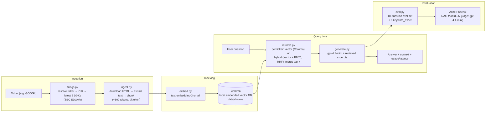

# Filings RAG Assistant

A retrieval-augmented generation (RAG) question-answering system over SEC
10-K filings, built as a personal portfolio project to demonstrate RAG
pipeline design and evaluation practice. Not a work project — no employer
data, no confidential information.

Ask questions like *"Which company had higher revenue, Alphabet or
Micron?"* and get an answer grounded in the actual filing text, with the
retrieved excerpts and cost/latency tracked.

## Architecture



Ingestion is generic (any ticker resolvable on SEC EDGAR); the hand-written
eval set and all reported metrics below are scoped to two companies,
**Alphabet (GOOGL)** and **Micron (MU)**, each with its latest 2 years of
10-K filings (782 chunks total: 394 GOOGL + 388 MU).

## Key design decisions

### Hybrid retrieval (BM25 + vector, RRF)

Pure vector search can miss exact figures and rare terms (e.g. "CMBU",
"1ß", a specific dollar amount) that don't paraphrase well semantically.
`retrieve(question, method="hybrid")` adds a keyword path next to the
default `method="vector"`:

- **BM25** (`rank_bm25.BM25Okapi`), one index per ticker, built lazily in
  memory from the chunks already stored in Chroma. Tokenizer: lowercase +
  `re.findall(r"\w+")`, so numbers and terms like "HBM" stay searchable.
- **Per ticker**: top 20 from vector search + top 20 from BM25, fused with
  **Reciprocal Rank Fusion** (`score = Σ 1/(60 + rank)`), keep `top_k`.
  RRF uses only ranks, so the two very different score scales (cosine vs.
  BM25) never need normalizing. Retrieval stays per ticker (see the
  cross-company bug below).
- Same return shape as vector; `score` is the RRF score (~0.016–0.033),
  used only for ordering. Default stays `"vector"`.

**Results** — vector and hybrid scored in the same run (same judge, same
day), 18 original questions:

| Metric | Vector | Hybrid |
|---|---|---|
| Context relevance | 0.83 | 0.78 |
| Groundedness | 0.94 | 0.94 |
| Answer relevance | 1.00 | 1.00 |
| Total tokens | 97,014 | 97,070 |

Historical reference (earlier run, vector): 0.83 / 1.00 / 1.00. The vector
answers in both runs are the *same cached answers*, so its groundedness
moving 1.00 → 0.94 is purely LLM-judge noise. The 0.05 context-relevance
gap is one question (the "current stock price" should-abstain question,
where irrelevant context is the expected outcome anyway) and within judge
noise. **On the original 18 questions, hybrid does not beat vector.**

**Separate `keyword_exact` set** (6 questions on exact figures/terms,
written from chunks in Chroma; reported separately so the 18-question
comparison is unchanged). This set favors BM25 by construction. Triad
averages were identical (1.00 / 0.83 / 1.00 for both), so correctness
against the expected answer is shown per question:

| # | Question (expected answer) | Rare term in | Vector | Hybrid |
|---|---|---|---|---|
| Q1 | Micron CMBU revenue increase, FY25 vs FY24 (257%) | question | ✅ | ✅ |
| Q2 | Micron 2029 B Notes rate (6.750%) | question | ✅ | ✅ |
| Q3 | Node for most of Micron's 2025 DRAM bits (1ß) | answer only | ❌ "1α and 1ß" | ❌ "1α and 1ß" |
| Q4 | Google Cloud revenue increase 2024→2025 ($15.5B) | answer only | ✅ | ✅ |
| Q5 | Alphabet 2025 buybacks (240M shares, $45.4B) | answer only | ❌ "not disclosed" | ✅ |
| Q6 | Alphabet 7th-gen TPU name (Ironwood) | question | ✅ | ✅ |

Vector 4/6, hybrid 5/6 — a one-question difference on 6 questions, not
statistically meaningful. Where the rare term is in the question (Q1, Q2,
Q6), both methods got all three right. Hybrid's one extra answer (Q5) is in
the group where the rare term is only in the answer. Both missed Q3: the
2025 sentence wasn't retrieved, and both answered from the prior year's
filing. Notably, the RAG triad passed vector's wrong Q5 abstention on all
three metrics — reference-free metrics can't tell a correct "I don't know"
from a wrong one.

### The cross-company retrieval bug, and how eval caught it

The first version of `retrieve()` combined every ticker's chunks into a
single pool and took one global top-k by similarity score. Running the
hand-written eval set against it, all 3 cross-company questions (e.g.
*"Which company had higher revenue, Alphabet or Micron?"*) failed: when
one company's chunks happened to score higher overall, the global top-k
filled up with that company's chunks and the other company's data never
made it into the context — so the model correctly refused to answer
rather than guess, but for the wrong reason (missing retrieval, not a
generation issue).

**Fix**: retrieve per ticker instead of globally — for each ticker,
query its own top-k chunks separately (`collection.query(..., where=
{"ticker": ticker})` against Chroma), then merge the results. This
guarantees every ticker is represented in the context regardless of how
its chunks score relative to another ticker's, at the cost of a fixed
`top_k * num_tickers` context size instead of a single shared top_k.
Re-running the eval afterward: all 3 cross-company questions passed.

The original global-top-k version is kept commented out directly above
the current implementation in `retrieve.py`, for comparison. A second,
independent revision later moved storage/query itself from a flat JSON
file + hand-rolled numpy cosine similarity to Chroma; that revision is
documented the same way (commented out above the current code) and in
`NOTES.md` (Step 4).

### RAG triad evaluation via Arize Phoenix

The eval set (`eval.py`) is 18 hand-written questions over GOOGL + MU,
split into 4 categories: factual, cross-company, cross-year, and
should-abstain (asking about things not in the filings, e.g. current
stock price, a CEO's hobby, next year's revenue).

Each answer is scored on the reference-free **RAG triad**, using
`gpt-4.1-mini` as the judge model via `arize-phoenix-evals`:

- **Context relevance** — is the retrieved context relevant to the question? (`RetrievalRelevanceEvaluator`)
- **Groundedness / faithfulness** — is the answer actually supported by that context? (`FaithfulnessEvaluator`)
- **Answer relevance** — does the answer address the question asked? (custom `create_classifier`, since Phoenix has no built-in evaluator under this name)

This avoids hand-labeling a "correct answer" for every question. Answers
are cached per `(retrieval method, question)` in `data/eval_cache.json` so
re-running the eval (e.g. after a judge-prompt change) doesn't re-spend
money regenerating unchanged answers; the RAG triad scores themselves are
always computed fresh.

See "Hybrid retrieval" above for the latest vector-vs-hybrid results.

## Tech stack

- Python 3.12, `uv` for environment/dependency management
- `requests` + `beautifulsoup4` — fetch and parse SEC filing HTML
- `tiktoken` — token-based chunking (~500 tokens, with overlap) and cost tracking
- OpenAI API (`OPENAI_API_KEY`):
  - Chat: `gpt-4.1-mini` (generation + LLM-as-judge)
  - Embeddings: `text-embedding-3-small`
- `chromadb` — local embedded vector database, persisted to disk, no server
- `arize-phoenix-evals` — RAG triad evaluation

## Running it

```bash
uv sync
echo "OPENAI_API_KEY=sk-..." > .env

uv run python ingest.py     # fetch + chunk GOOGL and MU 10-Ks (cached per ticker)
uv run python embed.py      # embed chunks into the Chroma collection (cached per ticker)
uv run python generate.py   # interactive Q&A loop over the terminal
uv run python eval.py       # run the 18-question eval set (vector), print RAG triad scores
uv run python eval.py --method hybrid --set keyword_exact   # other method / question set
```

Each `.py` module also has a matching `test_*.py` — plain `assert`-based
scripts (no test framework), run directly with `uv run python test_X.py`.
All OpenAI-hitting logic is mocked in tests; only `eval.py` and the
`__main__` blocks above make real API calls.

## Roadmap (in progress)

- FastAPI service
- Docker
- GitHub Actions CI with an evaluation regression gate

## Current limitations

- **No reranker** — hybrid retrieval exists but fused results aren't
  re-ranked by a cross-encoder.
- **`year` is the filing year, not the fiscal year** — labels are
  inconsistent across companies (Alphabet's FY2025 10-K is tagged 2026,
  Micron's FY2025 10-K is tagged 2025). Not fixed yet, since that would
  require re-embedding and break comparability with the baselines above.
- **No citation mechanism** — the generated answer doesn't point back to
  which retrieved chunk it came from; a user can't easily verify it
  against the source filing without reading the printed context.
- **Naive text extraction** — `ingest.py` strips `<script>`/`<style>` tags
  and keeps everything else, including some inline-XBRL metadata noise
  SEC embeds in modern filings.
- **Exact ticker matching only** — `filings.py` matches tickers
  case-insensitively but exactly; no fallback for a renamed ticker or
  multiple share classes.
- **No judge calibration** — RAG triad scores come from an LLM judge
  (`gpt-4.1-mini`) with no calibration against hand-labeled ground truth.
- **Not deployed** — no API endpoint or containerization; this is a local
  CLI pipeline only, by design for this project phase.
