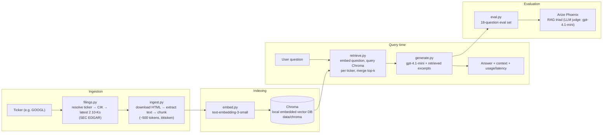

# Filings RAG Assistant

A retrieval-augmented generation (RAG) question-answering system over SEC
10-K filings, built as a personal portfolio project to demonstrate RAG
pipeline design and evaluation practice (Data Engineer → AI Engineer
transition). Not a work project — no employer data, no confidential
information.

Ask questions like *"Which company had higher revenue, Alphabet or
Micron?"* and get an answer grounded in the actual filing text, with the
retrieved excerpts and cost/latency tracked.

## Architecture



Ingestion is generic (any ticker resolvable on SEC EDGAR); the hand-written
eval set and all reported metrics below are scoped to two companies,
**Alphabet (GOOGL)** and **Micron (MU)**, each with its latest 2 years of
10-K filings (782 chunks total: 394 GOOGL + 388 MU).

## Key design decisions

### Vector-only retrieval, no hybrid search (yet)

Retrieval is pure vector similarity via Chroma — no BM25/keyword search,
no reranker. At this project's scale (782 chunks), a semantic-only search
is enough to answer most factual and comparison questions, and Chroma adds
persistence and metadata filtering without needing a server.

The known gap: pure vector search misses exact keyword/number matches that
don't paraphrase well semantically — e.g. a question naming a specific
dollar figure might not retrieve the exact table containing it as reliably
as a keyword match would. Hybrid retrieval (vector + BM25) would close
this gap but is explicitly deferred (see `CLAUDE.md`, "Explicitly out of
scope for now") until it's shown to matter on real eval failures, rather
than added speculatively.

### The cross-company retrieval bug, and how eval caught it

The first version of `retrieve()` combined every ticker's chunks into a
single pool and took one global top-k by similarity score. Running the
hand-written eval set against it, all 3 cross-company questions (e.g.
*"Which company had higher revenue, Alphabet or Micron?"*) failed: when
one company's chunks happened to score higher overall, the global top-k
filled up with that company's chunks and the other company's data never
made it into the context — so the model correctly refused to answer
rather than guess, but for the wrong reason (missing retrieval, not a
generation issue).

**Fix**: retrieve per ticker instead of globally — for each ticker,
query its own top-k chunks separately (`collection.query(..., where=
{"ticker": ticker})` against Chroma), then merge the results. This
guarantees every ticker is represented in the context regardless of how
its chunks score relative to another ticker's, at the cost of a fixed
`top_k * num_tickers` context size instead of a single shared top_k.
Re-running the eval afterward: all 3 cross-company questions passed.

The original global-top-k version is kept commented out directly above
the current implementation in `retrieve.py`, for comparison. A second,
independent revision later moved storage/query itself from a flat JSON
file + hand-rolled numpy cosine similarity to Chroma; that revision is
documented the same way (commented out above the current code) and in
`NOTES.md` / `INTERVIEW_NOTES.md` (Step 4).

### RAG triad evaluation via Arize Phoenix

The eval set (`eval.py`) is 18 hand-written questions over GOOGL + MU,
split into 4 categories: factual, cross-company, cross-year, and
should-abstain (asking about things not in the filings, e.g. current
stock price, a CEO's hobby, next year's revenue).

Each answer is scored on the reference-free **RAG triad**, using
`gpt-4.1-mini` as the judge model via `arize-phoenix-evals`:

- **Context relevance** — is the retrieved context relevant to the question? (`RetrievalRelevanceEvaluator`)
- **Groundedness / faithfulness** — is the answer actually supported by that context? (`FaithfulnessEvaluator`)
- **Answer relevance** — does the answer address the question asked? (custom `create_classifier`, since Phoenix has no built-in evaluator under this name)

This avoids hand-labeling a "correct answer" for every question. Answers
are cached per `(retrieval method, question)` in `data/eval_cache.json` so
re-running the eval (e.g. after a judge-prompt change) doesn't re-spend
money regenerating unchanged answers; the RAG triad scores themselves are
always computed fresh.

Latest run (18 questions, current Chroma-based retrieval):

| Metric | Score |
|---|---|
| Context relevance | 0.83 |
| Groundedness | 1.00 |
| Answer relevance | 1.00 |

Total: 97,014 tokens, 20.4s latency across all 18 questions.

## Tech stack

- Python 3.12, `uv` for environment/dependency management
- `requests` + `beautifulsoup4` — fetch and parse SEC filing HTML
- `tiktoken` — token-based chunking (~500 tokens, with overlap) and cost tracking
- OpenAI API (`OPENAI_API_KEY`):
  - Chat: `gpt-4.1-mini` (generation + LLM-as-judge)
  - Embeddings: `text-embedding-3-small`
- `chromadb` — local embedded vector database, persisted to disk, no server
- `arize-phoenix-evals` — RAG triad evaluation

## Running it

```bash
uv sync
echo "OPENAI_API_KEY=sk-..." > .env

uv run python ingest.py     # fetch + chunk GOOGL and MU 10-Ks (cached per ticker)
uv run python embed.py      # embed chunks into the Chroma collection (cached per ticker)
uv run python generate.py   # interactive Q&A loop over the terminal
uv run python eval.py       # run the 18-question eval set, print RAG triad scores
```

Each `.py` module also has a matching `test_*.py` — plain `assert`-based
scripts (no test framework), run directly with `uv run python test_X.py`.
All OpenAI-hitting logic is mocked in tests; only `eval.py` and the
`__main__` blocks above make real API calls.

## Current limitations

- **No hybrid retrieval / reranker** — see "Vector-only retrieval" above.
- **No citation mechanism** — the generated answer doesn't point back to
  which retrieved chunk it came from; a user can't easily verify it
  against the source filing without reading the printed context.
- **Naive text extraction** — `ingest.py` strips `<script>`/`<style>` tags
  and keeps everything else, including some inline-XBRL metadata noise
  SEC embeds in modern filings.
- **Exact ticker matching only** — `filings.py` matches tickers
  case-insensitively but exactly; no fallback for a renamed ticker or
  multiple share classes.
- **No judge calibration** — RAG triad scores come from an LLM judge
  (`gpt-4.1-mini`) with no calibration against hand-labeled ground truth.
- **Not deployed** — no API endpoint or containerization; this is a local
  CLI pipeline only, by design for this project phase.
